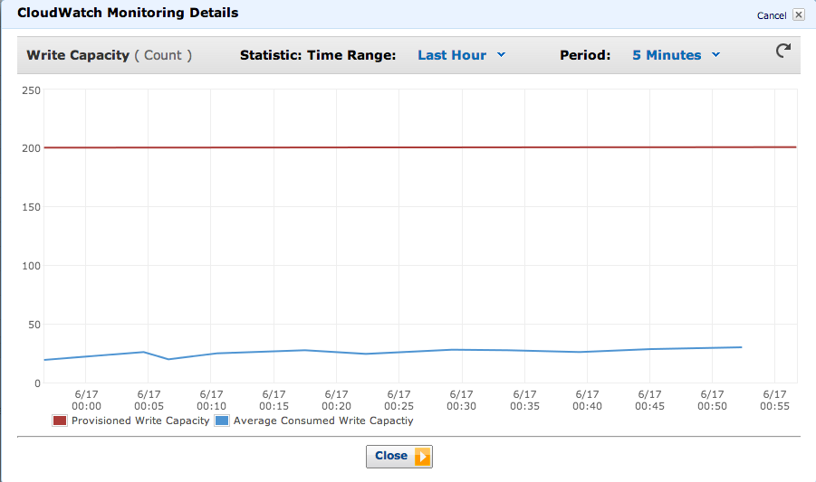
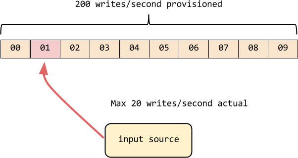
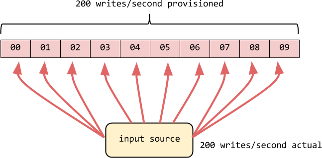
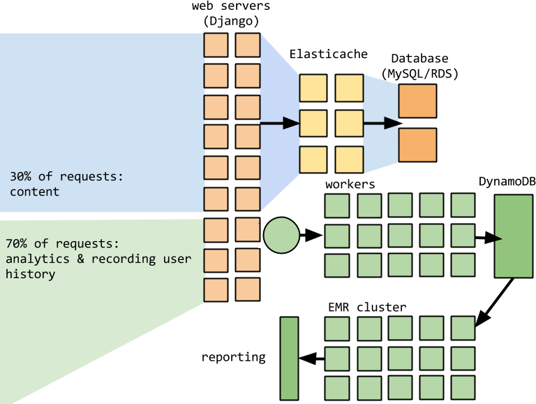
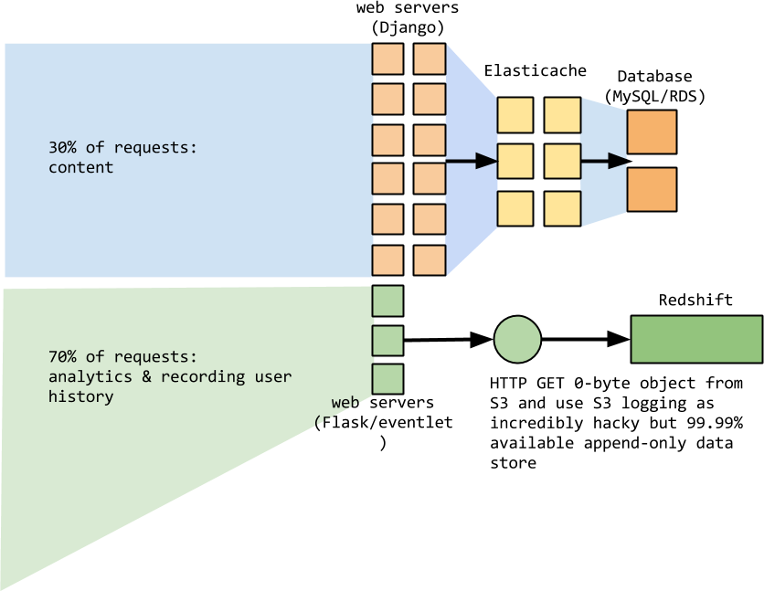
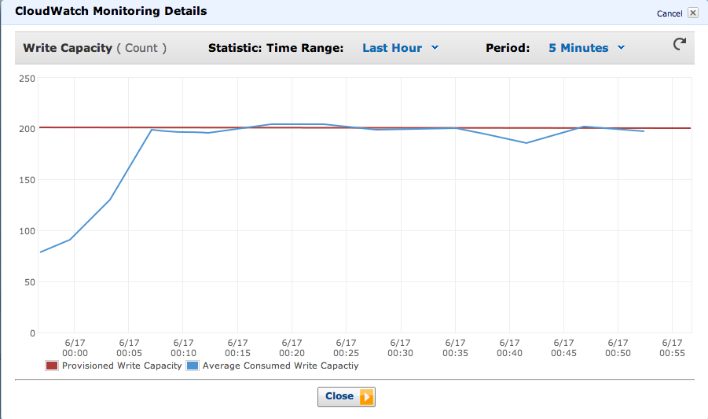
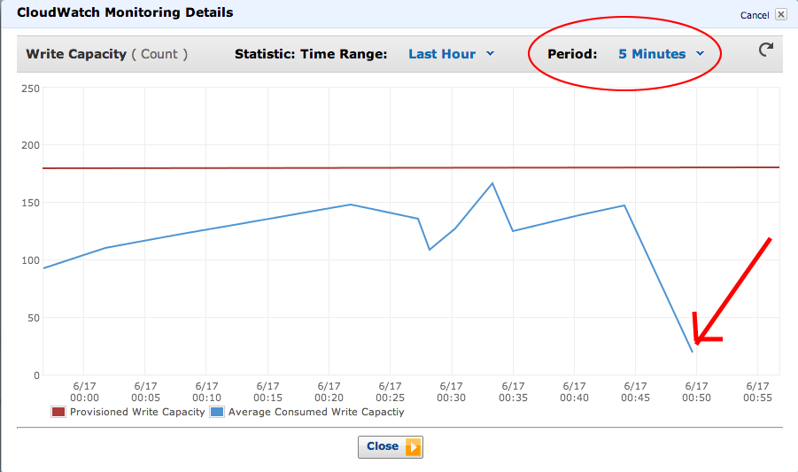
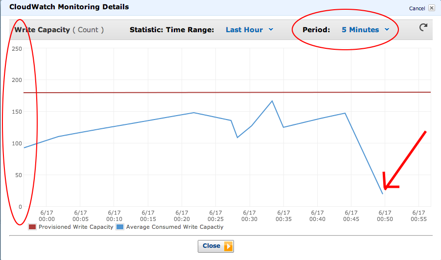
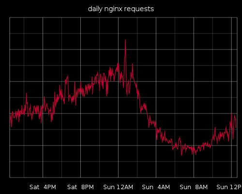

# Falling In and Out of Love with DynamoDB

tim gross | @0x74696d

http://0x74696d.com/slides/falling-in-and-out-of-love-with-dynamodb.html

---

# Tim Gross

 
 
 

# Presenter Notes

- I'm Tim Gross
- I do DevOps and develop software infrastructure for DramaFever.

---

# DramaFever

# Presenter Notes

- Online television network specializing in bringing curated foreign television
- from places like East Asia and Latin America and Spain
- to a mostly North American audience of about 5 million
- with English and Spanish subtitles.
- We're a startup headquartered in NYC with the technical team working out of Narberth PA.

---

# DramaFever, then

# Presenter Notes

- Our core application is hosted on AWS.
- When I started with DramaFever, the entire infrastructure was a bunch of Linux EC2 instances running Django and Apache and Memcached, backed by MySQL RDS.

---

# Team, then

- 2 full-stack developers
- 2 mobile developers
- 1 Flash developer
- 1 DevOps and back-end developer (hi!)
- 0 full-time operations
- 0 DBAs

---

# DramaFever, now

# Presenter Notes

- (some of this is near-term speculative, not real # of instances)
- More complex architecture
- Multiple internal services
- DynamoDB

---

# Team, now

- 5 full-stack developers
- 3 mobile developers
- 1 Flash developer
- 3 front-end developers
- 1 DevOps and back-end developer (hi!)
- 1 full-time operations
- 0 DBAs

# Presenter Notes

- More developers, hired an ops guy, no DBAs.
- Offload operations for the database systems.  Which is why we run RDS despites its flaws.
- DISCLAIMER: Any opinion I express here is about what works for us, our stack, and our team.

---

# Falling In and Out of Love With DynamoDB

  

# Presenter Notes

- Application & schema design
- Operations & cost control
- Lessons learned
- We bring stories to our users, I'm going to tell some stories
- Everything you ever wanted to know about DynamoDB but were afraid to ask.

---

# Neat stuff about Dynamo

 

## *Dynamo: Amazon's Highly Available Key-value Store*

http://www.read.seas.harvard.edu/~kohler/class/cs239-w08/decandia07dynamo.pdf

 

- Parallel operations
- Designed for availability across multiple data centers
- Pay-as-you-go means no upfront infrastructure costs
- No* maintenance

---

# Fan & Follow

---

# Fan & Follow

# Presenter Notes

- Totally not "Like"  =)
- New feature come up from the product team to allow users to "fan" and "follow" particular series, episodes, actors, or each other.

---

# Fan & Follow

# Presenter Notes

- Trace relationships across arbitrary objects -- a graph database.
- Users to Actors and Series ("Fan")
- Users to Users ("Follow")
- Be able to trace backwards

---

# Why Dynamo?

- Pay-as-you-go means no upfront infrastructure costs
- Good use case for hierarchal hash-range key structure.

# Presenter Notes

- Unproven feature so pay-as-you-go is a good model.

---

# Schema-less-ish

Table rows are referenced by primary key: a hash key or hash key + range key.

 

    primary key   |               attributes
    ---------------------------------------------------------------
    hash key      |  attribute  |  attribute  |  attribute, etc...

         primary key        |               attributes
    --------------------------------------------------------------------------
    hash key  |  range key  |  attribute  |  attribute  |  attribute, etc...

 

- Keys can be numbers, strings, or binary blob.
- Hash keys can be queried with API exactly or scanned with EMR.
- Range keys can be queried with API using hash key + range key conditions.
- Attributes are unstructured schemaless K/V pairs.

# Presenter Notes

- Keys and attributes can be numbers or strings or binary blobs.  Note no datetime.
- Hash queried exact only (ex. no greater-than 20) or by scanning (usually with EMR).
- Range queries with range key conditions (ex. exact, greater than, begins with, between, etc.) or by scanning.
- Each row has attributes, which are unstructured K/V pairs.  Up until recently with the addition of Secondary Indexes, you couldn't query on these at all without a scan.

---

# Hierarchal Keys

Hash keys and range keys have a parent-child relationship.

 

 

Range keys are sorted, but only with the "bucket" of a given hash key.

# Presenter Notes

- Big gotcha is that the keys have to be queried together.
- API queries allow hash-only query on a hash+range key (null BEGINS_WITH)
- Range keys are sorted, but only within the "bucket" of a hash key. (Important later)
- Can't ever say "give me all rows between A and B" without scanning.

---

# Fan & Follow

# Presenter Notes

- Natural hierarchy of keys
- Hash key is user you're asking about
- range key to find which actors, series, etc. the user is a fan of

---

# Fan & Follow

 

    hash key                 |   range key
    -------------------------------------------------------------
    content_type.entity_id   |   FAN_OF.content_type.entity_id
    content_type.entity_id   |   FANNED_BY.content_type.entity_id

 

- Double-writes (happens a lot in DynamoDB)
- Composite keys generally strings

# Presenter Notes

- "fanned by" is a separate row.
- So for each write, you write twice.  This is idiomatic DynamoDB.
- Note that these keys are all strings, so if you have Ints for IDs of the objects they're getting coerced to strings when combined into the key.
- Range keys will frequently be strings so you can do BEGINS_WITH queries.

---

# How do you query this thing?

Querying can be done with API (Python library is `boto`):

 

Which actors does this user follow?

    !python
    results = table.query(hash_key=user_id,
                          range_key=BEGINS_WITH('FAN_OF.Actor.'))

 

Who are this actor's fans?

    !python
    results = table.query(hash_key=actor_id,
                          range_key=BEGINS_WITH('FANNED_BY.User.')

# Presenter Notes

- generator of rows where we can easily take out the Actor id
- generator of rows where we can easily take out the User id

---

# The Firehose

 

# Presenter Notes

- Analytics "pings" from our video players (Flash and native mobile clients).
- This data gets used to divvy up revenue among video assets
- Lets us and content owners get paid
- Core business function

---

# The Firehose

# Presenter Notes

- But all that data was a) hitting the main Django application
- b) after a bunch of pre-processing, getting written into MySQL RDS.
- Giant append-only table of billions of rows, which isn't great.
- Traffic was about 70% of the total number of requests to the application.

---

# Key schema, first attempt

 

    hash key        | range key   |  attributes
    --------------------------------------------------------
    series.episode  | timestamp   |  a bunch of attributes

 

- Given series & episode, slice the range to get minutes streamed for a given period.
- Want to query all series and episodes for monthly reports?  Execute full table scan with EMR.

# Presenter Notes

- One consequence of this is that writing timeseries data is hard to get right.
- Full table scan to get data on all properties for a given period.  Problem will grow over time as assets are added.  Has another problem that I'll get to later. (Hot keys.)

---

# Re-design

# You will have this conversation:

 
<blockquote>

"Hey, you know in MongoDB you can..."

"Nope, hierarchal keys, remember?"
</blockquote>
 
# or this one:
<blockquote>

"Well in Redis you can..."

"Nope, hierarchal keys, remember?"
</blockquote>
 

# Many, many, many times.

---

# Key schema, bad hack

 

    hash key  | range key   |  attributes
    ------------------------------------------------------------------
    day       | timestamp   |  series, episode, a bunch of attributes

 

- Full scan but only over each day in your processing period, slice ranged within that.
- Aggregate data for series, episode via EMR.

# Presenter Notes

- You might try to hack around this like this
- In this case, your scan will be for each day in your processing period (ex. at the time 1 month for us), and you can slice ranges that way.
- You'll need to roll-up tables as you go and archive them.

---

# Key schema and provisioning

# Presenter Notes

- The problem with this came when we tested it.
- The actual write throughput was 1/10th of what we provisioned. =(

---

# Key schema and provisioning

Leaking abstraction!

- AWS spins up instances to accept provisioned throughput (exact number undocumented.)
- Provisioned throughput distributed among these instances.

Hot hash key --> hot instance

# Presenter Notes

- When you provision throughput, Amazon is spinning up N instances of whatever the underlying processes are.
- Your provisioned throughput is distributed among these instances.
- Rows are written to the instances based on the hash key, not the combined hash+range key. Duh, it's a hash, right?
- With hot key, throughput will be (provisioned throughput / however many instances Amazon has provisioned).

---

# Key schema and provisioning

# Presenter Notes

- Avoiding hot hash keys is key to DynamoDB performance.
- Division by provisioning means if you have a bad hash key you'll see diminishing returns on performance the higher you provision your throughput.
- This was also the hidden problem with using series/episode as hash.
- Plenty of key space, but too many hot writes (latest==popular).

---

# Key schema and provisioning

- Key schema design == direct operational cost
- Writes are at least 5x cost of reads.

# Presenter Notes

- Can be even more than that if your rows are more than 1KB in size:
- a unit of read capacity gets you 1 consistent read of up to 4KB (or 2 eventually consistent reads)
- whereas the write unit is for 1KB writes.

---

# So how the `fsck` do you do timeseries data?!

  

Amazon's recommended way:

 

    hash key                  | range key    |  attributes
    -----------------------------------------------------------------
    timestamp + random token  | session ID   |  series, episode, etc.

 

- 4 character random timestamp is enough to get good hash distribution for writes
- Reads with EMR only.

# Presenter Notes
- To do timeseries data, Amazon's recommended way to do it is to add a random token to the end of the timestamp
- 4 characters is enough to get the hashs distributed over the instances.
- You'll need to roll-up tables as you go and archive them.

---

# Key schema and throughput

Cannot query timeseries data without doing EMR jobs.

    !python
    results = []
    for i in range(9999):
        key = str(my_timestamp) % i
        results.append(table.query(hash_key=key))

# Presenter Notes

- Don't do this.  This is terrible!  10000 round-trips!
- This tightly couples the use of DynamoDB to EMR for that kind of data.

---

# Cost control

# Presenter Notes

- SQS + Workers + DynamoDB provisioning + EMR == $$$
- Still hadn't solved the problem of all the load we were putting on our main application.
- Costs started escalating.
- Writing directly from web application --> writing one row at a time.

---

# Asynchronous workers

# Presenter Notes

- Split off the analytics requests to different web servers (running async processes)
- wrote to SQS, picked up by workers running async process
- doing batch-reads from SQS to queue up a batch-write of up to 25 rows.
- Dropped half our web servers and 70% of our workers.
- Batch writing to DynamoDB is critical to good production throughput.

---

# Goodbye, DynamoDB! <sniff>

# Presenter Notes
- (flip back to previous slide to mention EMR/BI)
- Still had dependency on EMR.
- Wanted to give BI on this system, so we started using Redshift.
- Ultimately replaced this entire system with S3 logging hacks and Redshift.

---

# Streamtracking

# Presenter Notes

- Our premium users are treated to videos without advertisements.
- We limit the number of simultaneous streams for a premium user
- Reduce the risk of premium users sharing their account (revenue loss)

---

# Streamtracking

- Wanted to implement tracking of this stream without causing a lot of write/read activity on MySQL.
- Assumed most users are honest: DB activity would be mostly spurious.

---

# Key schema

For each check, if number of tokens exceeds limit, then shut off the oldest stream the next time it checks in. The video player then complains to the user.

 

    hash key   | range key                  |  attributes
    -----------------------------------------------------------------
    user ID    | browser-identifying-GUID   |  timestamp

 

- Plenty of user IDs to avoid hot keys
- Product wanted tokens to be persistent for BI
- Not bullet-proof but "good enough"

---

# Throttling

# Presenter Notes
- It was hard to accurately estimate actual throughput on this, because we didn't know what the #s were on check frequency.
- We made an estimate and actual traffic was more than expected.
- Writes to DynamoDB should be asynchronous
- If you get throttled, you'll end up blocking the web thread.
- We got occassionally throttled due to spikey loads, and it blocked the web thread.

---

# DynamoDB monitoring is terrible

# Presenter Notes

- The smallest resolution you can get on throughput is 5 minutes
- Cloudwatch metrics often lag by 10-15 minutes
- This means you can be throttled but your monitoring systems won't tell you until it's too late!

---

# ... but it was worse

# Presenter Notes

- Up until a couple months ago, the Cloudwatch metrics had a different scale of units vs time than the provisioning, and that scale was undocumented!
- Turned out to be tied to the monitoring resolution -- 5 minutes.
- "3000" in your Cloudwatch metric, that represented a throughput of 10 writes/second.
- Cloudwatch metrics are still messed up, but at least the monitoring interface for DynamoDB will give you numbers in the same units you provision in now.
- Pointed this out to DynamoDB guys, so I'm taking credit for it.

---

# YMMV

# Presenter Notes

- We have a load that varies 5x between morning and evenings.
- "Prime time television" still exists on the web.
- You may need to overprovision and then scale down once you understand the average load.
- (Or do detailed load testing, but we never seem to do that.)

---

# Semi-homemade auto-scaling

- DynamoDB API allows up to +100% provisioning adjustment per API call.
- You have to wait for the call to complete!
- Only get 2 negative adjustments in the same 24 hour period on a given table.

# Presenter Notes
- Load that varies requires active monitoring via API
- drop at thresholds or at times of day

---

# Semi-homemade auto-scaling

    !python
    dyconn=boto.connect_dynamodb(AWS_ACCESS_KEY_ID,AWS_SECRET_ACCESS_KEY)

    if now.hour > 6:  #check for raising limit
        pMetric = Metric.replace('Consumed', 'Provisioned')
        provo = c.list_metrics("", {'TableName': tablename},
                               pMetric,
                               "AWS/DynamoDB")
        threshold=provo[0].query(start, end, 'Sum','Count',60)[0]['Sum']
        tperc=count/threshold
        if tperc > .80:
            provset[READ_CAP] = dyconn.describe_table(tablename)\
                                ['Table'][PROVISIONED][READ_CAP]
            provset[WRITE_CAP] = dyconn.describe_table(tablename)\
                                 ['Table'][PROVISIONED][WRITE_CAP]
            provset[pMetric]=threshold*1.2
            table_name = dyconn.get_table(tablename)
            dyconn.update_throughput(table_name,
                                     provset[P_READ_CAP],
                                     provset[P_WRITE_CAP])

# Presenter Notes

- Estimating in advance (if you can) is a better method
- We schedule 2 drops in provisioned throughput
- One at the end of East Coast primetime and another several hours later at the end of West Coast primetime. (checks metric first)
- Don't start scaling up until the morning again.

---

# Alas, poor Dynamo...

- Turns out users were even more honest than we expected.
- Wasn't worth the added costs.
- Replaced with an identical system that uses memcached for token storage.

---

# User History

  

# Presenter Notes
- Still had a lot of write pressure on the main database.
- The biggest case of this is what we called UserEpisode and ContinueWatching.
- Let the user resume watching a video where they left off.

---

# User History

# Presenter Notes
- Lots of INSERTS and UPDATES on a very large MySQL InnoDB table
- heavily indexing due to all the queries we had to make on it
- poor performance and lots of table locks.

---

# User History

- Pull it out of MySQL and into DynamoDB
- Key design was complicated.
- Requirement to read the data without EMR; need to query via API.
- Be able to display user's history in aggregate, organized by series

# Presenter Notes

- Need to tell what episode of a series was last watched
- Get history organized by series.
- Querying was never the problem on existing system, it was always write locks.

---

# Key schema

User, series, and episode number make up the schema.

 

     hash key  | range key             |  attributes
     ----------------------------------------------------------------------
     user      | series_id.episode_id  |  video timestamp, watched datetime

---

# Key schema

Easy to get where a user is in a given video.

    !python
    results = table.query(hash_key=user,
                          range_key=EXACT('%s.%s' % (series.episode)))

 

Easy to get all episodes for a series.
 

    !python
    results = table.query(hash_key=user,
                          range_key=BEGINS_WITH('%s.' % (series,)))

 

Get most-recently watched for a Series is not too bad either.

# Presenter Notes

- get all the episodes and sort by watched_datetime in the web process.

---

# But...

- Getting most-recently watched for multiple Series means getting user's entire history and grouping / sorting / iterating over it.
- Alternate schemas that won't work: can't include the video timestamp or watched_datetime in the range_key, because then you can't update the value without finding the old row, removing it, and adding the new row.
- Don't want to process in the web thread because biggest user histories would take multiple trips to the DB to get all the pages.

---

# Multiple tables for same data is idiomatic DynamoDB

 

The Amazon-recommended way:

 
UserEpisode table

     hash key  | range key             |  attributes
     ----------------------------------------------------------------------
     user      | series_id.episode_id  |  video timestamp, watched datetime

 
MostRecentlyWatchedEpisode table

     hash key  | range key  |  attributes
     ----------------------------------------------------------------------
     user      | series_id  |  episode_id, video timestamp, watched datetime

# Presenter Notes

- Gross, but most queries can be done with 1 read (max 2).
- (Turns out we do the 2nd one way more)
- Writes require 2 writes.

---

# Querying

Where is this user in a given video?

    !python
    table = UserEpisodeTable.get_table()
    results = table.query(hash_key=user,
                          range_key=EXACT('%s.%s' % (series.episode)))

 

What is the most recently-watched episode for this user for this series?

    !python
    table = MostRecentlyWatchedEpisode.get_table()
    results = table.query(hash_key=user,
                          range_key=EXACT('%s' % (series,)))

 

What are the most recently-watched episodes for this user for all series?

    !python
    table = MostRecentlyWatchedEpisode.get_table()
    results = table.query(hash_key=user,
                          range_key=BEGINS_WITH(''))

# Presenter Notes
- some of these are bad queries to begin with
- last one is computationally expensive for large histories
- we can't easily page-in results

---

# Another table?!

 
MostRecentlyWatchedSeries table

     hash key  | attributes
     ----------------------------------------
     user      | ordered list of series_ids

# Presenter Notes

- Really gross, but most queries can be done with 1 read (max 2).
- Lets us read in the series ids and then page from UserEpisode or MRWE as needed
- Writes require 2 writes + 1 read + 1 optional write.
- Secondary indexes would greatly improve this problem
- They didn't exist when we designed this.

---

# Migrations

Exporting via EMR can be done, but the production migration would be tough.

- Fast bulk uploading of data *to* DynamoDB is overly complicated.
- You can use EMR from other DynamoDB tables
- From MySQL or external source, you're building your own batch writer.

# Presenter Notes

- Concurrency for uploads is tough.

---

# Batch uploads

    !python
    import csv
    import boto
    from multiprocessing import Pool

    def write_data(filename):
        """
        This will be called by __main__ for each process in our Pool.
        Error handling and logging of results elided.
        Don't write production code like this!
        """
        conn = boto.connect_dynamodb(aws_access_key_id=MY_ID,
                                     aws_secret_access_key=MY_SECRET)
        table = conn.get_table('my_table_name')

        with open(filename, 'rb') as f:
            reader = csv.reader(f)
            items = []
            for row in reader:
                dyn_row = table.new_item(hash_key='{}',format(row[0]),
                                         attrs = {'series': row[1],
                                                  'episode': row[2],
                                                  'timestamp': row[3],
                                                  'moddt': row[4] })
                items.append(dyn_row)

# Presenter Notes

- Dump the data you need to CSV
- Read it in, but this would blow up memory, so...

---

# Batch uploads

    !python
            if len(items) > 25:
                batch_items = items[:25]
                batch_list = conn.new_batch_write_list()
                batch_list.add_batch(table, batch_items)
                response = conn.batch_write_item(batch_list)
                if not response['UnprocessedItems']:
                    items = items[25:]
                else:
                    unprocessed = [ ui['PutRequest']['Item']['user']
                                    for ui in
                                    response['UnprocessedItems']\
                                            ['my_table_name']]
                for item in batch_items:
                    if item['user'] not in unprocessed:
                        items.remove(item)

# Presenter Notes

- We flush the queue of items to write once we get to 25 (max batch size)
- Have to check return values b/c when you get throttled you need to retry those items
- This creates a lot of malloc, but keeps total commit low.

---

# Batch uploads

    !python

    if __name__ == '__main__':
        files = ['xaao','xabf','xabw',... ]
        pool = Pool(processes=len(files))
        pool.map(write_data, files)

 
For full source and notes, see:

## *DynamoDB Batch Uploads*

http://0x74696d.com/posts/dynamodb-batch-uploads

# Presenter Notes

- Map a split file across multiple processes to greatly increase concurrency.
- gevent is another good way to do this w/ Python (exc. GIL-contention)

---

# Is DynamoDB the right tool for the job?

 

- Poor key design --> cost & pain
- Batch write with high concurrency
- Use active monitoring and throughput estimation

---

# Falling In and Out of Love with DynamoDB

tim gross | @0x74696d

http://0x74696d.com/slides/falling-in-and-out-of-love-with-dynamodb.html

<i>These slides use `landslide`, press P to get presenter's notes</i>

