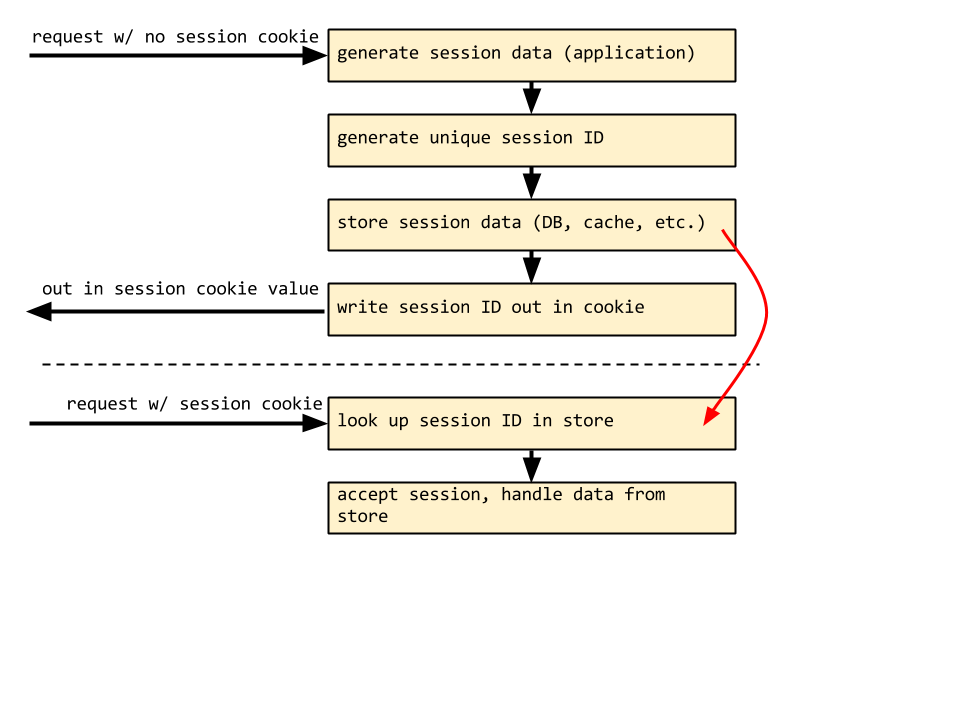

# Flask sessions in Riak

tim gross | @0x74696d

http://0x74696d.com/slides/flask-riak-sessions/

http://github.com/tgross/flask-riak-sessions/

# Presenter Notes

- I'm Tim Gross
- I do DevOps and develop software infrastructure for DramaFever.
- DynamoDB talk, Hector from Basho says try Riak
- Session store for Flask in Riak (project in progress)
- Session stores a problem @ DF due to write contention on the DB, Django's signed cookies don't support encryption
- Want to expand this into a full authentication system for OAuth2 clients
- Very briefly touch on Riak and sessions, then go into some code

---

# Riak in Brief

- Distributed key-value store
- Eventually consistent; designed for "AP"

# Presenter Notes

- bucket + key => 160-bit hash
- hash space divided equally among nodes

---

# Riak Availability

- Hinted handoff (inter-node communication to determine bad ring neighbors)
- `n` replication number causes objects to replicated to `n` partitions

# Presenter Notes

- Consistent hashing means new nodes get new writes

---

# Riak Consistency

CAP-tuning features

- `r` and `w` allow client-specified consistency requirements
- eventual consistency w/ metadata

Vector Clock

- each stored value is tagged w/ initial version
- graphs whether objects are descendants, have common parents, etc.
- used to auto-repair out-of-sync data

# Presenter Notes

- r/w is the number of replicas that have to have to succeed
- r/w tunable per request
- which object value returning sync'd w/ vector clock

---

# Client-side sessions (stateless)

# Presenter Notes

- No state on the server
- Note order of operations in serialize/deserialize
- Racy!

---

# Client-side sessions (stateless)

HMAC-signed client-side cookies store session data

- data can be read by client unless cookie data is encrypted server-side first
- data can't be undetectably tampered with
- Flask ships with `itsdangerous` to do client-side session cookie

# Presenter Notes

- client-side reading is sometimes an advantage
- encrypting data lets it be stored "on the wire"
- we use this at DF b/c of speed, reduced write-pressure on DB
- will use at DF for storing client-readable

---

# Server-side sessions (stateful)

# Presenter Notes

- state is persisted in the data store
- needs to be fast, highly-available
- cookie token should be hard to spoof
- N.B. both stateless and stateful should protect w/ httponly/SSL-only if used for auth
- Riak/Dynamo/any-eventually-consistent-store sessions are still racy!

---

# Flask-RiakSessions

`flask_riaksessions.py`

    !python
    class RiakSession(CallbackDict, SessionMixin):
        """
        Implements a Flask session for storage in Riak.
        """

        def __init__(self, initial=None, sid=None, token=None,
                     new=False, expiry=None):

            def on_update(self):
                """
                Set the dirty-session flag.
                """
                self.modified = True

            CallbackDict.__init__(self, initial, on_update)
            self.sid = sid
            self.token = token
            self.new = new
            self.modified = False
            self.expiry = expiry

        @property
        def key(self):
            return '{}!{}'.format(self.token, self.sid)

# Presenter Notes

- SessionMixin plugs this into Flask
- CallbackDict is from werkzeug

---

# Flask-RiakSessions

    !python
    class RiakSessions(object):
        """
        Sets up the Flask-RiakSessions extension during application
        startup. Instantiate this class and pass the application to
        the `app` argument to set it up.

        """
        def __init__(self, app=None):
            self.app = app
            if app is not None:
                self.init_app(app)

        def init_app(self, app):
            """
            Sets up default config variables and instantiates the
            session interface.

            """
            app.config.setdefault('RIAK_BIN_DIR',
                                  os.environ.get('RIAK_DIR',''))
            app.config.setdefault('RIAK_HTTP_PORT', 10018)
            app.config.setdefault('RIAK_SESSIONS_HASH_FUNCTION',
                                  hashlib.sha256)

            app.session_interface = RiakSessionInterface(app)

# Presenter Notes

- fairly typical Flask extension boilerplate
- sets default config values and adds code to app context

---

# Flask-RiakSession

`app.py` (example)

    !python
    from datetime import datetime

    from flask import Flask, session, request
    from flask.ext.riaksessions import RiakSessions

    app = Flask(__name__)
    app.config.from_object(__name__)
    app.config['SECRET_KEY'] = 'mysecretkey'

    RiakSessions(app)

# Presenter Notes

- Flask boilerplate
- instantiates the RiakSessionInterface and attached it to `app.session_interface`

---

# Flask-RiakSession

    !python
    @app.route('/')
    def hello():
        previous_visit = session.get('last_visit', False)
        last_ip = session.get('ip', False)
        session['last_visit'] = datetime.now()
        session['ip'] = request.remote_addr
        if not previous_visit:
            return 'Hello, stranger from {}'.format(request.remote_addr)
        return 'Last visit was {} from {}'.format(previous_visit, last_ip)

 

---

# Flask-RiakSession

    !python
    class RiakSessionInterface(SessionInterface):

        def open_session(self, app, request):
            """
            Fetch the session from the Riak database after validating the
            session ID or create a new session ID + session.

            """
            cookie = request.cookies.get(app.session_cookie_name)
            ip = request.remote_addr
            # Flask test server has no User-Agent
            user_agent = request.headers.get('User-Agent', 'NULL')

            if cookie:
                try:
                    session = self.get(cookie, app, ip, user_agent)
                    return session
                except SessionValidationError:
                    # pass and generate a new session
                    LOG.exception('Invalid session')

            sid = generate_sid(app, ip, user_agent)
            session = RiakSession(sid=sid, token=uuid4(), new=True)
            session.expiry = self.get_expiration_time(app, session)
            return session

# Presenter Notes

- still in flask_riaksessions.py
- if there's a session cookie, try to get the session
- if not, create a new session ID and new session

---

# Flask-RiakSession

    !python
    def generate_sid(app, ip, user_agent):
        """
        Uses the IP and user-agent as the inputs to an HMAC to be used
        as part of the unique session ID.

        """
        sid = get_hmac(app, '{}.{}'.format(ip,base64.b64encode(user_agent)))
        return sid

    def get_hmac(app, content):
        """
        Generates the hash message authentication code (HMAC) using the
        application configuration and the passed content.
        Takes the RIAK_SESSIONS_HASH_FUNCTION and SECRET_KEY app config.

        """
        hash_function = app.config['RIAK_SESSIONS_HASH_FUNCTION']
        secret = app.config['SECRET_KEY']
        return base64.b64encode(hmac.new(secret, content,
                                         hash_function).digest())

# Presenter Notes

- Using user agent & IP address not enough to ID user
- concat w/ UUID, username, etc.
- Using IP/User-Agent is a standin
- will use an HMAC of user information for authenticated users + browser identifiers

---

# Flask-RiakSession

    !python
    def get(self, cookie, app, ip, user_agent):
        """
        Gets the session data from the Riak datastore and compares the
        HMAC signatures of inputs against the session ID to ensure it
        has not been altered.

        """
        sid = generate_sid(app, ip, user_agent)
        token, cookie_sid = cookie.split('!', 1)

        if cookie_sid != sid:
            raise SessionValidationError('Tampered session.')

        # this uses `riak-python-client` from basho
        session_bucket = self.client.bucket('sessions')
        stored_value = session_bucket.get(cookie)

        # check expiry and deserialize data
        if stored_value:
            expiry, serialized = stored_value.get_data()
            if serialized and (expiry is None or expiry > datetime.now()):
                data = json.loads(serialized, object_hook=date_hook)
                return RiakSession(data, sid=sid, token=token, expiry=expiry)

        # no valid session, create a new one
        session = RiakSession(sid=sid, token=uuid4(), new=True)
        session.expiry = self.get_expiration_time(app, session)
        return session

# Presenter Notes

- instantiated riak client in __init__ (trivial)
- `date_hook` in deserialization is a custom decoder subclass to decode datetimes
- validation is stand-in still.

---

# Flask-RiakSession

    !python
    def save_session(self, app, session, response):
        """
        This will be called by Flask during request teardown.  Saves the
        session if it has been modified.

        """
        domain = self.get_cookie_domain(app)
        if not session:
            response.delete_cookie(app.session_cookie_name, domain)
            return

        if not session.modified:
            return

        self.put(session)
        cookie_contents = session.key
        response.set_cookie(app.session_cookie_name, cookie_contents,
                            expires=session.expiry,
                            httponly=self.get_cookie_httponly(app),
                            secure=self.get_cookie_secure(app),
                            domain=domain)

# Presenter Notes

- Checks if the session has been modified
- Puts in the data store
- Respects app config for httponly and secure cookies

---

# Flask-RiakSession

    !python
    def put(self, session):
        """
        Stores the session data and expiry time in the Riak datastore.

        """
        session_bucket = self.client.bucket('sessions')
        session_object = session_bucket.new(session.key,
                                            (session.expiry,
                                             json.dumps(dict(session),
                                                        cls=Encoder)))
        session_object.store()

# Presenter Notes

- of course I'm not using pickle because it's dangerous

---

# Next steps

Need to verify program correctness and service robustness, make available to developers

- Interface w/ user accounts for validation
- Test rig for exercising Riak (node failure, stale vector clocks)
- Test `setup.py` deployments
- Vagrant file to build a Riak cluster of VMs for
- Package for Cheese Shop (open source w/ MIT license)

Compare vs DynamoDB

- Build similar library for DynamoDB
- Provisioning cost estimation for EC2 vs. DynamoDB
- Load testing on EC2 and DynamoDB (`ab` or similar)

# Presenter Notes

- Riak gives you plenty of interface tools
- Riak dev server is broken currently (at least on OS X under certain installs).

---

# Flask sessions in Riak

tim gross | @0x74696d

http://0x74696d.com/slides/flask-riak-sessions/

http://github.com/tgross/flask-riak-sessions/

